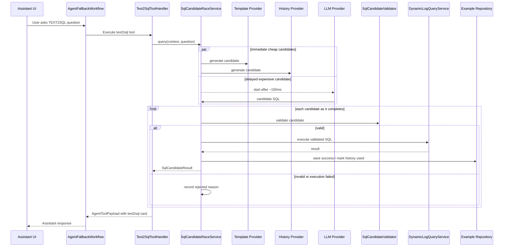

# Text2SQL Candidate Race Design

## Goal

Improve the intelligent assistant `TEXT2SQL` path by racing three SQL candidate sources: deterministic templates, successful historical queries, and LLM-generated SQL. The assistant should use the first candidate that is generated, validated, executed successfully, and safe for the current ClickHouse datasource.

This feature only changes the intelligent assistant `TEXT2SQL` flow. It does not change normal log list queries, trend APIs, schema tools, vector component creation, or `/api/stats/ai-query`.

## Current Problem

The current `Text2SqlToolHandler` still uses a tightly coupled path:

1. Run old preflight strategies.
2. If preflight does not handle the request, call `AiQueryService.query()`.
3. `AiQueryService.query()` generates SQL and executes it in one step.

This makes LLM generation the only fallback for many queries. When the model service is slow, unstable, or blocked by permission errors, even simple requests such as "查最近一小时的日志数据总数" can fail.

There is also partially written candidate-provider code in the workspace, but it is not wired into the actual `TEXT2SQL` execution path yet.

## Recommended Architecture

Use a strategy model for candidate generation and a single race service for orchestration.

### Responsibilities

`Text2SqlToolHandler`

- Validate that the current datasource is ClickHouse.
- Delegate candidate selection and SQL execution to `SqlCandidateRaceService`.
- Keep the existing frontend `text2sql` result card shape.
- Add candidate metadata to `AgentResult.summary`.

`SqlCandidateProvider`

- Strategy interface for generating SQL candidates.
- A provider only decides whether it supports the query and returns a `SqlCandidate`.
- It must not execute SQL, write history, or decide final safety.

`TemplateSqlCandidateProvider`

- Generate deterministic SQL for high-frequency assistant questions.
- v1 scope includes simple count and common dimension count.
- It should not call LLM.

`HistorySqlCandidateProvider`

- Search `agent_sql_query_examples` for successful SQL used by the same user and datasource.
- Use lightweight normalization and token similarity.
- Return the most similar SQL candidate above the threshold.

`LlmSqlCandidateProvider`

- Call `AiQueryService.generateSqlOnly()`.
- It only generates SQL and never executes it.
- It starts after a short delay so cheap candidates can win first.

`SqlCandidateValidator`

- Validate every candidate before execution.
- Allow only `SELECT` or `WITH`.
- Reject dangerous keywords such as `DELETE`, `ALTER`, `DROP`, `TRUNCATE`, `CREATE`, `SYSTEM`, and `KILL`.
- Ensure referenced tables match the current datasource table.
- Validate backticked fields against current datasource schema.
- Add a default `LIMIT 200` if the candidate SQL does not include a limit.

`SqlCandidateRaceService`

- Sort candidate providers by order.
- Start template and history providers immediately.
- Start LLM provider after about 150ms.
- Validate and execute each returned candidate.
- Return the first candidate that validates and executes successfully.
- Cancel or ignore slower candidates after a winner is selected.
- Save successful SQL into `agent_sql_query_examples`.
- Mark a reused historical example as used.
- If all candidates fail, return a clear failure message with rejected reasons.

`AgentSqlQueryExampleRepository`

- Store successful SQL examples only after validation and successful execution.
- Scope lookup by `userId + datasourceId`.
- Keep simple text similarity in v1; no vector database is introduced.

## Data Model

Add PostgreSQL table `agent_sql_query_examples` through Liquibase:

- `id`
- `user_id`
- `datasource_id`
- `datasource_type`
- `question`
- `normalized_question`
- `sql_template`
- `result_type`
- `hit_count`
- `last_used_at`
- `created_at`
- `updated_at`

Indexes:

- `(user_id, datasource_id, updated_at DESC)` for recent lookup.
- `(datasource_id, normalized_question)` for normalized question lookup.

Only successful and validated queries are stored.

## Runtime Flow

## Race Policy

The v1 policy is cost-controlled rather than maximum parallelism.

- Template and history start immediately because they are local and cheap.
- LLM starts after about 150ms because it is expensive and can fail due to remote model/service issues.
- If template or history returns a valid executable result before LLM starts, the LLM call should not be submitted.
- If LLM is already running when a cheaper candidate wins, its result is ignored and cancellation is best-effort.
- Overall timeout should be bounded so the assistant does not wait indefinitely.

## Result Contract

The frontend `AgentResult.type` remains `text2sql`.

`AgentResult.summary` should add:

- `candidateSource`: `template`, `history`, or `llm`.
- `candidateRaceMs`: total race duration in milliseconds.
- `validatedCandidates`: candidate sources that passed validation.
- `rejectedCandidates`: readable rejection reasons.

Existing fields such as `sql`, `rows`, `rawResult`, `queryResultType`, `sqlGenerationTime`, `sqlExecutionTime`, and `totalExecutionTime` remain available.

## Error Handling

If no provider returns a usable candidate:

- The assistant should return a clear error such as "没有可执行的安全 SQL 候选".
- The error should include concise rejection reasons, for example:
  - `template: not supported`
  - `history: no similar successful query`
  - `llm: SQL 包含禁止关键字`
  - `llm: SQL 查询表不属于当前数据源`

If SQL execution fails after validation, the failed candidate is rejected and the race continues until timeout or another candidate succeeds.

## Cleanup Decisions

The old `Text2SqlPreflightStrategy`, `LogCountMetricPreflightStrategy`, and `DimensionCountPreflightStrategy` should be removed or fully replaced by candidate providers. Keeping both systems active would make the code hard to reason about and would recreate the coupling problem.

`AiQueryService.query()` should remain available for existing non-assistant callers. The assistant race path should use `AiQueryService.generateSqlOnly()` through `LlmSqlCandidateProvider`.

## Test Strategy

Use TDD for implementation.

Unit tests:

- `TemplateSqlCandidateProviderTest`
  - Simple count query returns a template candidate and does not require LLM.
  - Dimension count query returns a grouped SQL candidate.

- `HistorySqlCandidateProviderTest`
  - Similar normalized question returns a history candidate.
  - Low similarity returns empty.

- `SqlCandidateValidatorTest`
  - Accepts safe `SELECT`.
  - Rejects write or DDL SQL.
  - Rejects cross-table SQL.
  - Rejects unknown backticked fields.
  - Adds `LIMIT 200` when missing.

- `SqlCandidateRaceServiceTest`
  - Template candidate wins before LLM starts.
  - History candidate can win.
  - LLM candidate is used when template and history do not match.
  - Invalid candidates are rejected and reasons are collected.
  - Successful candidates are saved to history.

Handler regression tests:

- `Text2SqlToolHandlerTest`
  - Calls race service and returns existing `text2sql` card shape.
  - Summary includes candidate source and race metadata.

Build verification:

- Run focused agent service tests.
- Run `mvn -pl log-analysis-app -DskipTests compile`.

## Out of Scope

- No frontend UI change.
- No vector component creation changes.
- No model-based intent changes.
- No vector database for history similarity.
- No async job state model; the race happens within the request.
- No change to normal `/api/stats/ai-query` behavior.
