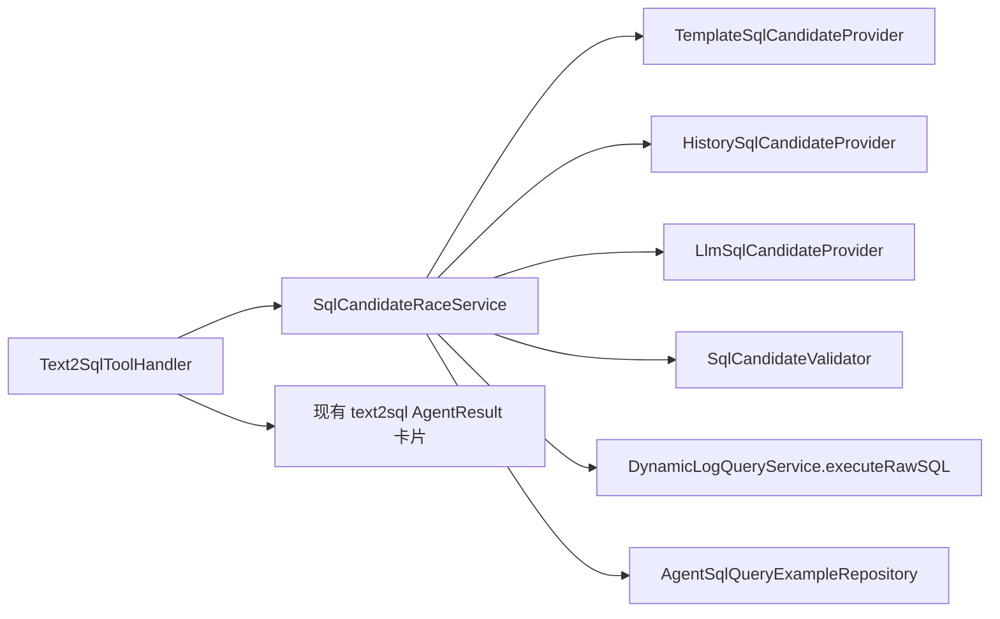
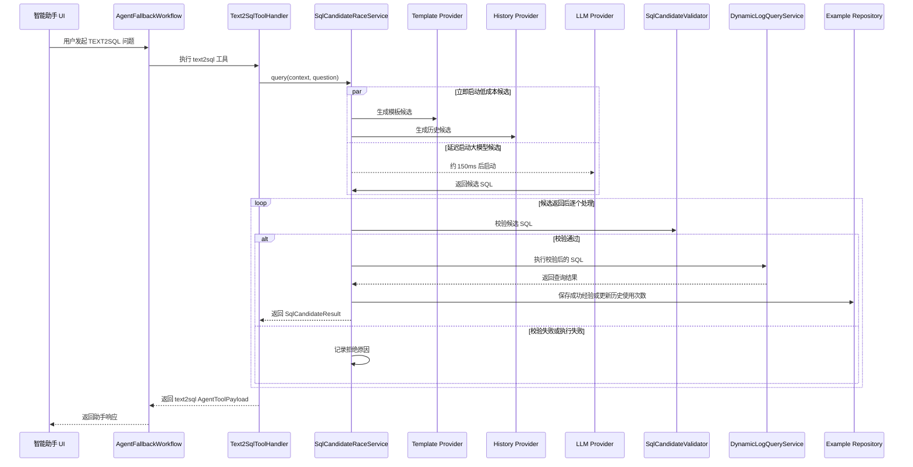

# Text2SQL 候选竞争设计

## 目标

优化智能助手 `TEXT2SQL` 链路，引入“模板解析、历史相似查询、大模型生成”三类 SQL 候选并发竞争机制。助手只采用第一个“生成成功、校验通过、执行成功、且属于当前 ClickHouse 数据源”的候选结果。

本次只改智能助手的 `TEXT2SQL` 流程，不改普通日志列表查询、趋势接口、字段结构工具、Vector 组件创建链路，也不改 `/api/stats/ai-query` 的既有行为。

## 当前问题

当前 `Text2SqlToolHandler` 仍然是强耦合链路：

1. 先跑旧的 preflight 策略。
2. preflight 未处理时，直接调用 `AiQueryService.query()`。
3. `AiQueryService.query()` 在一个方法里完成 SQL 生成和 SQL 执行。

这会导致很多查询仍然依赖大模型兜底。模型服务慢、不稳定、权限受限或返回异常时，即使是“查最近一小时的日志数据总数”这类简单问题，也可能失败。

当前工作区已经有部分候选 Provider 半成品，但还没有接入真正的 `TEXT2SQL` 执行链路。

## 推荐架构

采用“候选生成策略 + 统一竞争编排”的结构。

### 组件职责

`Text2SqlToolHandler`

- 校验当前数据源必须是 ClickHouse。
- 将候选选择和 SQL 执行委托给 `SqlCandidateRaceService`。
- 保持前端现有 `text2sql` 结果卡片结构不变。
- 在 `AgentResult.summary` 中补充候选来源和竞争耗时等元信息。

`SqlCandidateProvider`

- SQL 候选来源策略接口。
- Provider 只判断自己是否支持当前问题，并返回 `SqlCandidate`。
- Provider 不执行 SQL、不写历史、不做最终安全决策。

`TemplateSqlCandidateProvider`

- 为高频助手问题生成确定性 SQL。
- v1 覆盖简单总数统计和常用维度分组统计。
- 不调用大模型。

`HistorySqlCandidateProvider`

- 从 `agent_sql_query_examples` 中查找同一用户、同一数据源下的成功 SQL 经验。
- 使用轻量文本归一化和 token 相似度匹配。
- 返回超过相似度阈值的最相似 SQL 候选。

`LlmSqlCandidateProvider`

- 调用 `AiQueryService.generateSqlOnly()`。
- 只生成 SQL，不执行 SQL。
- 延迟启动，让模板和历史这类低成本候选先竞争。

`SqlCandidateValidator`

- 所有候选 SQL 执行前必须统一校验。
- 只允许 `SELECT` 或 `WITH` 查询。
- 拒绝 `DELETE`、`ALTER`、`DROP`、`TRUNCATE`、`CREATE`、`SYSTEM`、`KILL` 等危险关键字。
- 校验 SQL 引用的表必须是当前数据源表。
- 校验反引号字段必须存在于当前数据源 schema。
- SQL 未带 `LIMIT` 时自动追加默认 `LIMIT 200`。

`SqlCandidateRaceService`

- 按优先级排序所有 `SqlCandidateProvider`。
- 立即启动模板候选和历史候选。
- 大模型候选延迟约 150ms 启动。
- 对每个返回候选做校验和执行。
- 返回第一个“校验通过且执行成功”的候选结果。
- 有结果胜出后，对慢候选做尽力取消或忽略。
- 成功 SQL 写入 `agent_sql_query_examples`。
- 如果命中历史候选，更新历史记录使用次数。
- 所有候选失败时，返回清晰失败原因。

`AgentSqlQueryExampleRepository`

- 只保存已校验且执行成功的 SQL 经验。
- 查询范围限定为 `userId + datasourceId`。
- v1 只做轻量文本相似匹配，不引入向量库。

## 数据模型

通过 Liquibase 新增 PostgreSQL 表 `agent_sql_query_examples`：

- `id`
- `user_id`
- `datasource_id`
- `datasource_type`
- `question`
- `normalized_question`
- `sql_template`
- `result_type`
- `hit_count`
- `last_used_at`
- `created_at`
- `updated_at`

索引：

- `(user_id, datasource_id, updated_at DESC)`：用于查询最近成功经验。
- `(datasource_id, normalized_question)`：用于归一化问题查询。

只保存成功执行并通过校验的查询。

## 运行流程

## 竞争策略

v1 采用“成本可控”策略，而不是所有候选无脑同时跑。

- 模板候选和历史候选立即启动，因为它们是本地低成本操作。
- 大模型候选延迟约 150ms 启动，因为它成本高，并且可能受远程模型服务异常影响。
- 如果模板或历史在大模型启动前已经返回可执行结果，就不提交大模型调用。
- 如果大模型已经开始执行，而低成本候选随后胜出，则忽略大模型结果，并尽力取消。
- 整体竞争必须有超时边界，避免智能助手一直等待。

## 返回协议

前端 `AgentResult.type` 仍然保持 `text2sql`。

`AgentResult.summary` 增加：

- `candidateSource`：候选来源，取值为 `template`、`history` 或 `llm`。
- `candidateRaceMs`：候选竞争总耗时，单位毫秒。
- `validatedCandidates`：通过校验的候选来源列表。
- `rejectedCandidates`：可读的候选拒绝原因列表。

既有字段继续保留：

- `sql`
- `rows`
- `rawResult`
- `queryResultType`
- `sqlGenerationTime`
- `sqlExecutionTime`
- `totalExecutionTime`

## 异常处理

如果没有任何候选可用，助手返回明确错误，例如：

`没有可执行的安全 SQL 候选`

错误中应包含简洁的拒绝原因，例如：

- `template: not supported`
- `history: no similar successful query`
- `llm: SQL 包含禁止关键字`
- `llm: SQL 查询表不属于当前数据源`

如果候选 SQL 校验通过但执行失败，该候选会被拒绝，并继续等待其他候选，直到有候选成功或整体超时。

## 清理决策

旧的 `Text2SqlPreflightStrategy`、`LogCountMetricPreflightStrategy`、`DimensionCountPreflightStrategy` 应删除，或完全被候选 Provider 替代。不能让旧 preflight 和新 candidate race 两套系统同时生效，否则会继续造成理解成本高、执行路径不清晰的问题。

`AiQueryService.query()` 继续保留给已有非智能助手调用方。智能助手候选竞争链路只通过 `LlmSqlCandidateProvider` 调用 `AiQueryService.generateSqlOnly()`。

## 测试策略

实现时使用 TDD。

单元测试：

- `TemplateSqlCandidateProviderTest`
  - 简单总数查询返回模板候选，不需要调用大模型。
  - 按维度统计查询返回分组 SQL 候选。

- `HistorySqlCandidateProviderTest`
  - 相似归一化问题可以返回历史候选。
  - 相似度不足时返回空。

- `SqlCandidateValidatorTest`
  - 接受安全 `SELECT`。
  - 拒绝写入或 DDL SQL。
  - 拒绝跨表 SQL。
  - 拒绝不存在的反引号字段。
  - SQL 缺少 `LIMIT` 时追加 `LIMIT 200`。

- `SqlCandidateRaceServiceTest`
  - 模板候选在大模型启动前胜出。
  - 历史候选可以胜出。
  - 模板和历史不命中时使用大模型候选。
  - 非法候选被拒绝，并记录拒绝原因。
  - 成功候选会保存到历史经验库。

Handler 回归测试：

- `Text2SqlToolHandlerTest`
  - 调用 race service 并返回现有 `text2sql` 卡片结构。
  - `summary` 中包含候选来源和竞争元信息。

构建验证：

- 运行 agent service 相关定向测试。
- 运行 `mvn -pl log-analysis-app -DskipTests compile`。

## 不在本次范围

- 不改前端 UI。
- 不改 Vector 组件创建链路。
- 不改模型意图识别。
- 不引入向量库做历史相似查询。
- 不引入异步 job 状态；候选竞争在当前请求内完成。
- 不改变普通 `/api/stats/ai-query` 行为。
